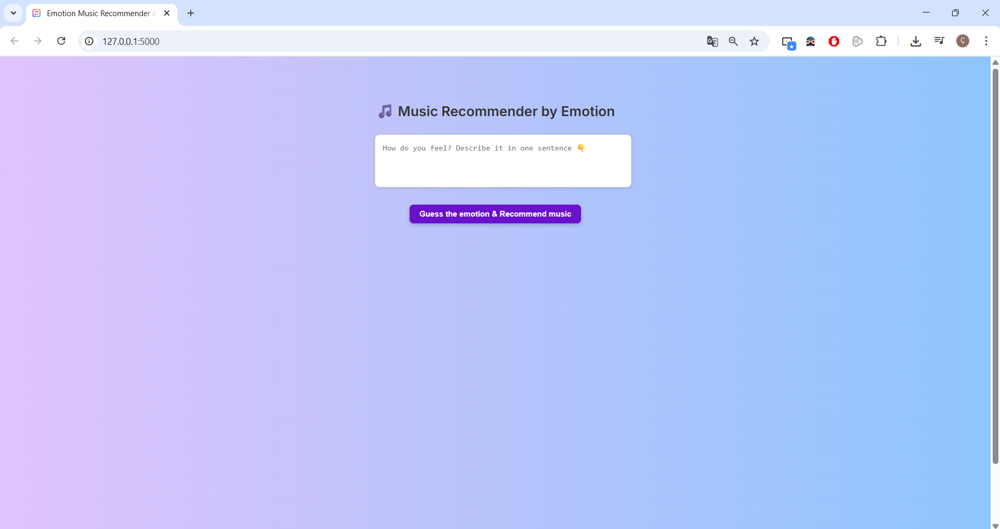
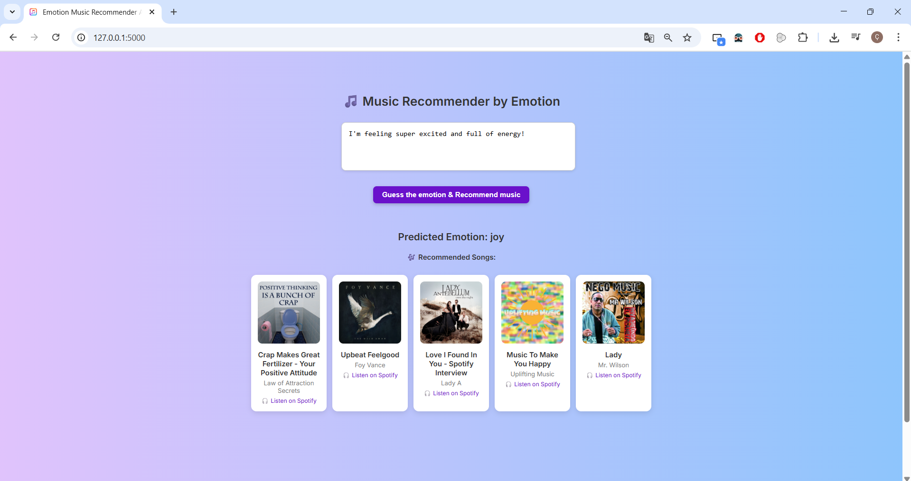
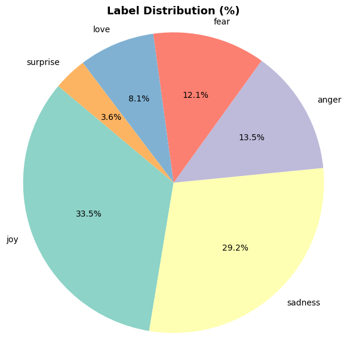
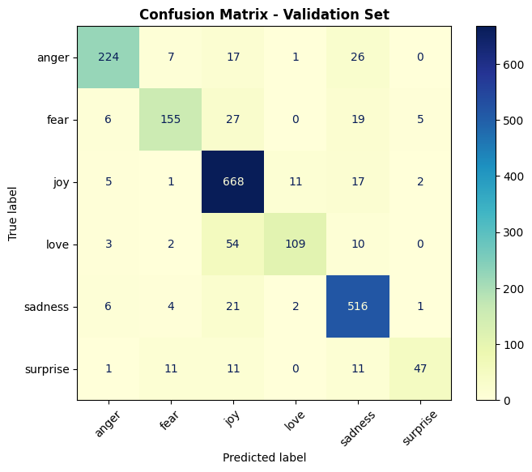
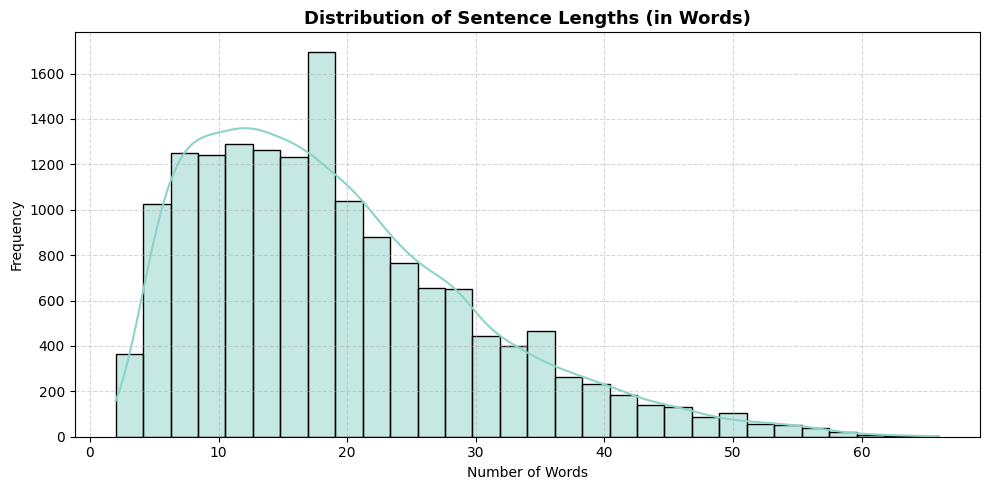

<a id="readme-top"></a>
<p align="center">
  
</p>

<h1 align="center">Emotion Music Recommender App</h1>

<p align="center">
 An AI-powered web application that predicts emotions from user text and recommends personalized music tracks. Built with NLP models and Flask, this system provides a seamless experience for emotion recognition and music recommendation.
</p>
</br>


## Table of Contents

1. [Overview](#overview)  
2. [Key Features](#key-features)  
3. [Getting Started](#getting-started)  
   - [Prerequisites](#prerequisites)  
4. [Usage](#usage)  
5. [Technical Details](#technical-details)  
   - [Dependencies](#dependencies)  
   - [Dataset & Model](#dataset--model)
   - [Evaluation Results](#evaluation-results)
   - [Supporting Files](#supporting-files)  
6. [Folder Structure](#folder-structure)  
7. [License](#license)


<p align="right">(<a href="#readme-top">back to top</a>)</p>
<br>


## Overview

**Emotion Music Recommender App** is a machine learning-powered platform designed to detect emotions from text and recommend music that matches the user’s current mood.  
The system uses a **pretrained emotion classification model** (built on NLP techniques) and provides an intuitive **Flask-based web interface**.

Users simply enter a sentence, and the application:
- Detects the **emotion** (e.g., happy, sad, angry).
- Suggests **music tracks** from a curated playlist that match the detected mood.

## Application Screenshots
<p align="center">
  
  
</p>

<p align="right">(<a href="#readme-top">back to top</a>)</p>
<br>


## Key Features

| **Functionality**             | **Details** |
|-------------------------------|-------------|
| **Emotion Detection**         | Predicts emotions from user-provided text using a trained NLP model. |
| **Music Recommendation**      | Suggests music tracks (JSON-based playlist) based on detected emotions. |
| **Web Interface**             | User-friendly Flask web UI for input and results display. |
| **Pretrained Models**         | Uses `emotion_model.pkl` and `label_encoder.pkl` for emotion classification. |
| **Lightweight Setup**         | No heavy GPU requirements, runs smoothly on CPU. |

<p align="right">(<a href="#readme-top">back to top</a>)</p>
<br>


## Getting Started

To run **Emotion Music Recommender App** locally, follow these steps:

- Make sure Python 3.10 or later is installed.  
- Ensure `pip` package manager is available.

<br>

### Prerequisites

Install the dependencies from `requirements.txt`:
```bash
pip install -r requirements.txt
```

<p align="right">(<a href="#readme-top">back to top</a>)</p>
<br>


## Usage

1. **Clone the repository and install dependencies:**
   ```bash
   pip install -r requirements.txt
   ```

2. **Run the Flask app:**
   ```bash
   python app.py
   ```

3. **Stop the server at any time:**
   ```bash
   CTRL+C
   ```

Then visit **http://127.0.0.1:5000** in your browser.

<p align="right">(<a href="#readme-top">back to top</a>)</p>
<br>


## Technical Details

### Dependencies

This project relies on the following Python libraries:

- Flask  
- scikit-learn  
- numpy  
- pandas  
- pickle  

> Tested on Python 3.10 with Flask 2.3.2

<p align="right">(<a href="#readme-top">back to top</a>)</p>
<br>


### Dataset & Model

The emotion classification is powered by the **Kaggle Emotions Dataset for NLP**, which contains 16,000 text samples labeled with 6 emotion categories:

```
['joy', 'sadness', 'anger', 'fear', 'love', 'surprise']
```

**Label Distribution:**
- joy: 5362  
- sadness: 4668  
- anger: 2159  
- fear: 1937  
- love: 1304  
- surprise: 572  

**Model Pipeline:**
- **Text Vectorization:** TF-IDF (ngram_range=(1,2), max_features=10,000)
- **Classifier:** Logistic Regression
- **Artifacts:** `emotion_model.pkl` and `label_encoder.pkl` store the trained pipeline and label mappings.

**Exploratory Data Analysis (EDA):**
- Label distribution pie chart and histograms.
- Word Cloud for all text samples.
- Sentence length distribution (in words).

> **Kaggle Notebook:** [Emotion Classification from Text using Supervised](https://www.kaggle.com/code/caglakacar/emotion-classification-from-text-using-supervised)

<p align="right">(<a href="#readme-top">back to top</a>)</p>
<br>


## Evaluation Results

This section showcases evaluation metrics and visualizations from the validation set.

#### Label Distribution
<p align="center">
  
</p>

#### Confusion Matrix
<p align="center">
  
</p>

#### Sentence Length Distribution
<p align="center">
  
</p>

<p align="right">(<a href="#readme-top">back to top</a>)</p>
<br>


### Supporting Files

- **emotion_model.pkl:** Pretrained emotion classification model.  
- **label_encoder.pkl:** Label encoder mapping class IDs to emotion strings.  
- **requirements.txt:** List of required Python packages.  
- **favicon.png:** App icon used in the web interface.  

<p align="right">(<a href="#readme-top">back to top</a>)</p>
<br>


## Folder Structure
```
Emotion_Music_Recommender_App/
│
├── app.py                       
├── emotion_model.pkl            
├── label_encoder.pkl            
├── templates/
│   └── index.html               
├── static/
│   └── favicon.png              
├── requirements.txt             
```

<p align="right">(<a href="#readme-top">back to top</a>)</p>
<br>


## License

This project is licensed under the MIT License.  
See the [LICENSE](LICENSE) file for details.

<p align="right">(<a href="#readme-top">back to top</a>)</p>